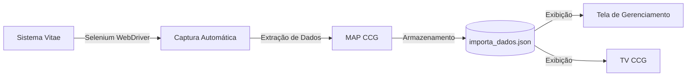
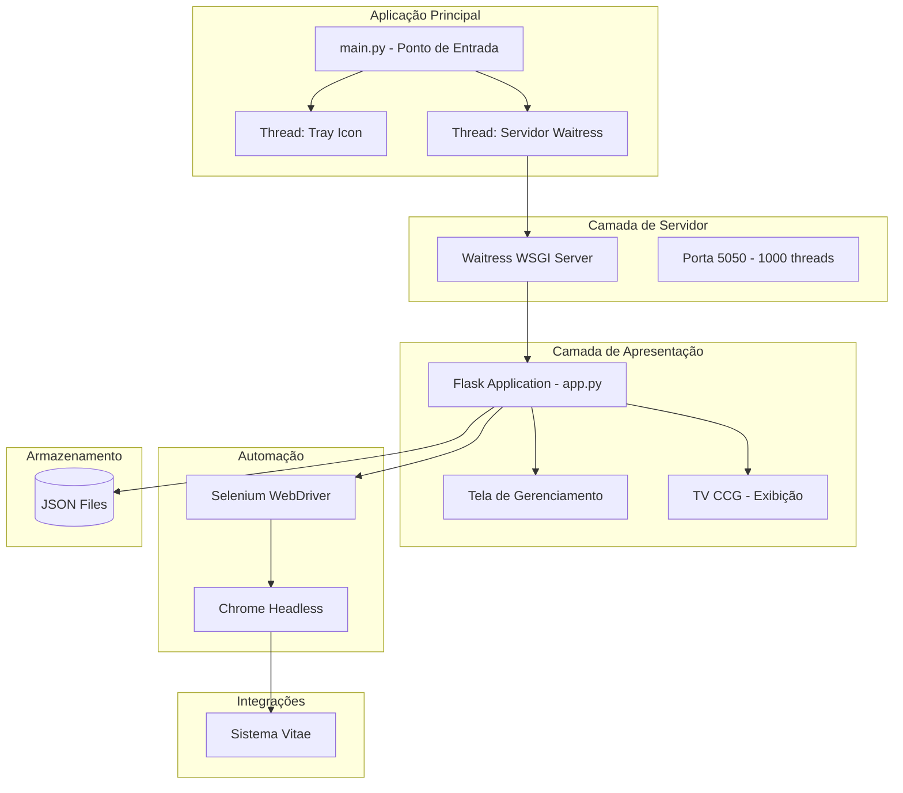
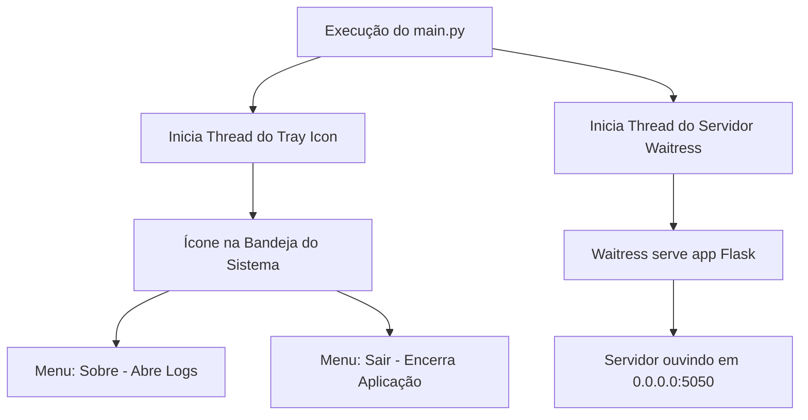
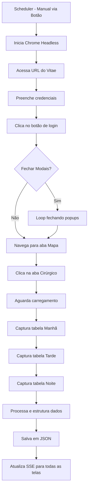

# 🏥 MAP CCG - Sistema de Gerenciamento do Centro Cirúrgico

[](https://semver.org)
[](LICENSE)
[]()
[](https://www.python.org/)
[](https://flask.palletsprojects.com/)
[](https://docs.pylonsproject.org/projects/waitress/en/stable/)
[](https://www.selenium.dev/)

## 📋 Sobre o Projeto

O **MAP CCG** é um sistema desenvolvido para otimizar a gestão das cirurgias no Centro Cirúrgico, proporcionando uma visualização clara e organizada do mapa cirúrgico diário. A solução permite o gerenciamento completo das cirurgias, transferência entre turnos com identificação visual por cores e exibição em tempo real para orientação das equipes cirúrgicas.

O sistema é executado como um **aplicativo em background** com ícone na bandeja do sistema (system tray), permitindo controle discreto e fácil acesso às funcionalidades.

### 🏥 Status Atual de Implantação

Sistema em produção no **Centro Cirúrgico do Hospital Regional Norte**, com integração total ao sistema Vitae.

## 🎯 Objetivos de Negócio

- **Gestão Centralizada:** Unificar o gerenciamento das cirurgias em uma única plataforma
- **Visualização Intuitiva:** Organização por turnos com codificação de cores para fácil identificação
- **Comunicação Eficiente:** Exibição em TV no CCG para orientação das equipes cirúrgicas
- **Atualização em Tempo Real:** Refletir instantaneamente qualquer alteração no mapa cirúrgico via SSE
- **Integração Automática:** Importar cirurgias diretamente do sistema Vitae via Selenium WebDriver
- **Operação Discreta:** Aplicativo executado em background com ícone na bandeja do sistema

## 👥 Público-Alvo e Perfis de Acesso

### Sistema de Autenticação
O sistema possui autenticação própria com gerenciamento de usuários em arquivo JSON, com diferentes níveis de permissão.

### Perfis e Permissões

| Perfil | Permissões |
|--------|------------|
| **Administrador** | Acesso total ao sistema, incluindo gerenciamento de usuários e todas as funcionalidades |
| **Colaborador** | Acesso à visualização do mapa e operações básicas (padrão) |

### Funcionalidades de Segurança
- **Hash de Senhas:** Utiliza `werkzeug.security.generate_password_hash` e `check_password_hash`
- **Sessões Gerenciadas:** Flask sessions com `app.secret_key`
- **Login Obrigatório:** Decorator `@login_required` para rotas protegidas

## 🚀 Funcionalidades Principais

### 1. Interface de Bandeja do Sistema (System Tray)

O aplicativo roda em background com um ícone na bandeja do sistema Windows:

| Funcionalidade | Descrição |
|----------------|-----------|
| **Ícone na Bandeja** | Ícone personalizado (map_ccg.ico) na área de notificações |
| **Menu Contextual** | Opções disponíveis ao clicar com botão direito no ícone |
| **Sobre / Logs** | Abre uma janela de console para visualização dos logs do servidor |
| **Sair** | Encerra completamente o servidor e o aplicativo |

### 2. Tela de Gerenciamento (Painel Administrativo)

Interface completa para gestão das cirurgias:

| Funcionalidade | Descrição |
|----------------|-----------|
| **Adicionar Cirurgia** | Inserção manual de novas cirurgias no mapa |
| **Editar Cirurgia** | Atualização de dados como paciente, procedimento, horário, etc. |
| **Excluir Cirurgia** | Remoção de cirurgias canceladas ou remanejadas |
| **Transferir entre Turnos** | Movimentação de cirurgias entre manhã, tarde e noite com atualização automática de cores |
| **Gerenciamento de Usuários** | Cadastro e controle de acesso de novos usuários |

### 3. Sistema de Turnos com Cores

As cirurgias são organizadas por turnos com identificação visual diferenciada:

| Turno | Horário | Cor | Significado |
|-------|---------|-----|-------------|
| **Manhã** | 07:00 - 13:00 | 🟡 Amarelo | Primeiro turno cirúrgico |
| **Tarde** | 13:00 - 19:00 | 🟠 Laranja | Segundo turno cirúrgico |
| **Noite** | 19:00 - 07:00 | 🟣 Roxo | Terceiro turno (emergências/continuidade) |

#### Transferência entre Turnos
- Quando uma cirurgia é transferida de turno, sua cor é automaticamente atualizada
- O sistema mantém o histórico no arquivo JSON
- Notificações SSE para todos os usuários conectados

### 4. Tela de Exibição (TV do CCG)

Interface otimizada para visualização em televisores no Centro Cirúrgico:

- **Layout Ampliado:** Fontes grandes e contraste elevado para visualização à distância
- **Atualização Automática via SSE:** Mudanças refletidas instantaneamente
- **Troca Automática de Turno:** O sistema identifica o horário e alterna automaticamente a exibição
- **Modo Manual:** Possibilidade de desativar a troca automática e controlar manualmente qual turno exibir

### 5. Integração com Sistema Vitae (Web Scraping)


### 5. Integração com Sistema Vitae (Web Scraping)

### 6. Arquitetura do Sistema

### 7. Fluxo de Inicialização do Aplicativo

### 8. Fluxo de Captura Automática (Selenium)

### 9. Fluxo de Troca de Turno Automática
```mermaid

graph TD
    A[Timer Agenda Próxima Troca] --> B[Calcula horário do próximo turno]
    B --> C[Timer aguarda segundos]
    C --> D[Hora da troca atingida]
    D --> E[determinar_turno - baseado na hora atual]
    E --> F[tabela_atual = novo turno]
    F --> G[notificacao_evento.set]
    G --> H[SSE envia evento para TV]
    H --> I[TV atualiza exibição]
    I --> J[Agenda próxima troca]
